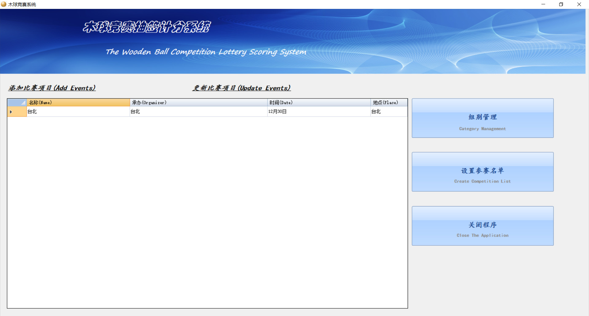
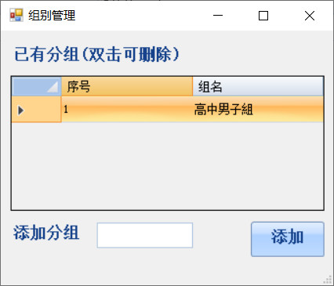
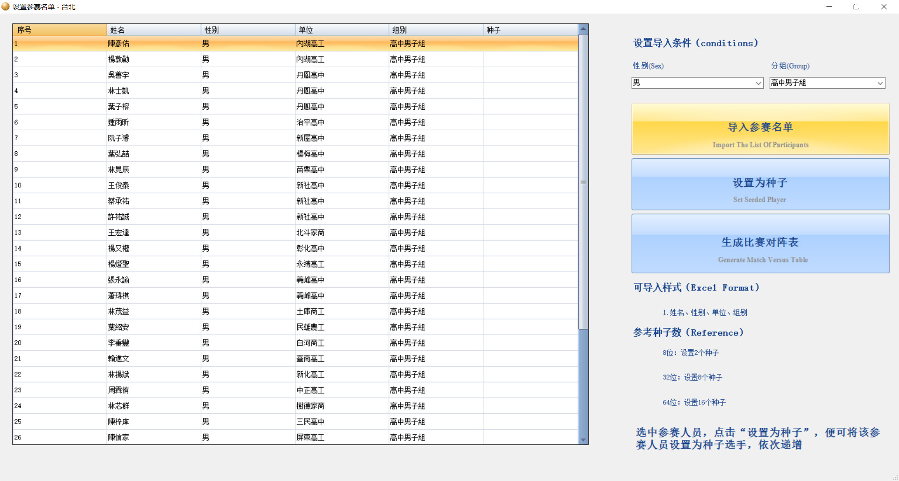
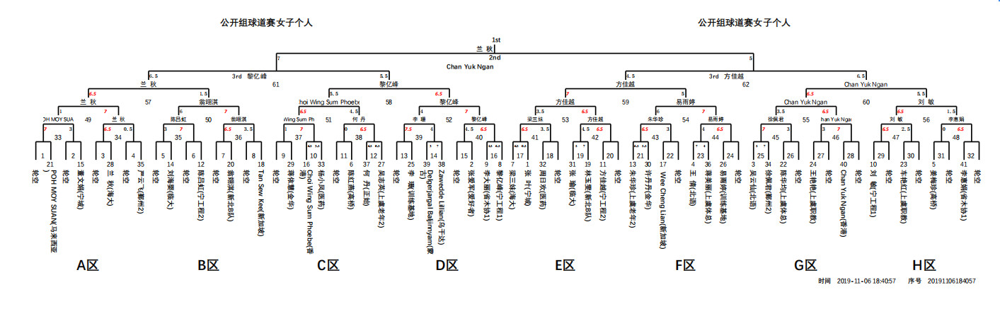
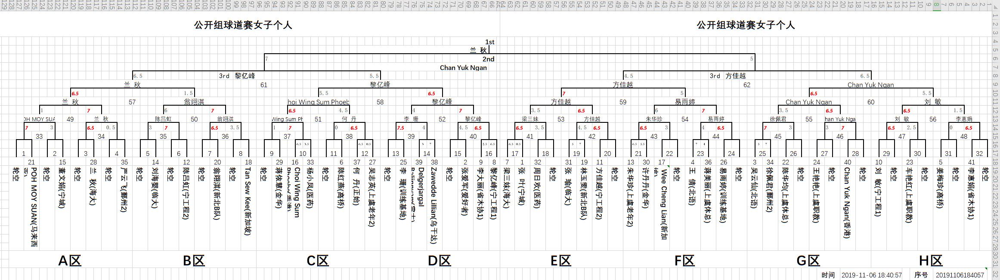

## 木球竞赛抽签积分系统

功能模块：
* 1、比赛管理：名称、承办、时间、地点
* 2、人员管理：姓名、单位、性别、组别（老年组、中年组、小学生组），excel导入
* 组别管理
* 生成对阵表
* 录入成绩
* 生成报表（PDF, Excel各一份）

技术：.net framework 4.5, winform, DoNetBar, NPOI, FreeSpire.XLS(免费版，PDF页数有限制)

#### 首页

#### 组别管理

#### 比赛管理

#### 生成报表
###### PDF

###### Excel

